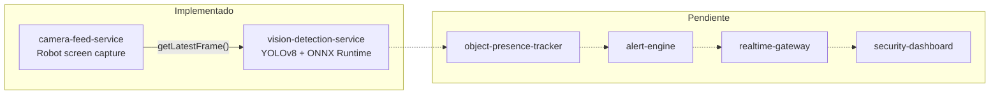

# Arquitectura general (estado actual)

- Linea solida: comunicacion ya implementada (llamada directa en memoria
  via `FrameCapturer.getLatestFrame()`).
- Linea punteada: comunicacion planeada, todavia sin implementar (esos
  modulos solo tienen el `pom.xml`/`package.json` base).

Ver [ADR 0001](../adr/0001-contenerizacion-servicios-captura-pantalla.md)
para el detalle de como se contenerizan los dos servicios implementados.
