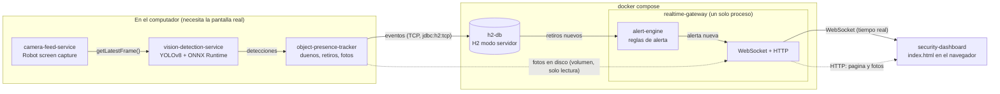

# Arquitectura general (estado actual)

- Linea solida: comunicacion implementada. Dentro del computador es una llamada directa en memoria; entre el
  tracker, la base y el gateway es por red (sockets TCP); del gateway al panel es un WebSocket.
- Linea punteada: el navegador pide la pagina y las fotos por HTTP; las fotos las escribe el tracker en el disco del
  computador y el contenedor las lee montadas en solo lectura.
- `alert-engine` y `security-dashboard` no tienen contenedor propio: el motor corre dentro del proceso del gateway y el
  panel es un `index.html` que el gateway entrega.
- Sin Docker tambien funciona: si no se define `SAFEMODE_DB_URL`, el tracker y el gateway comparten el archivo H2 local
  (`AUTO_SERVER`), como antes.

Ver [ADR 0001](../adr/0001-contenerizacion-servicios-captura-pantalla.md) para como se contenerizan los servicios de
captura, y [ADR 0002](../adr/0002-docker-compose-gateway-y-base-de-datos.md) para la base de datos compartida y el
gateway.
